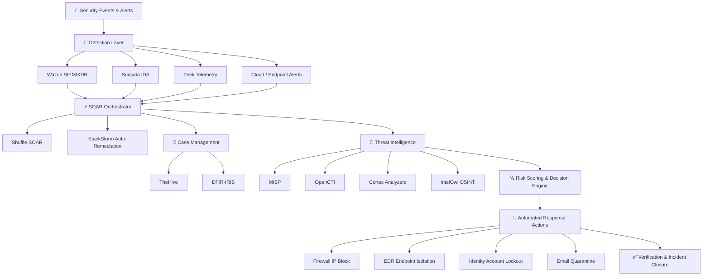
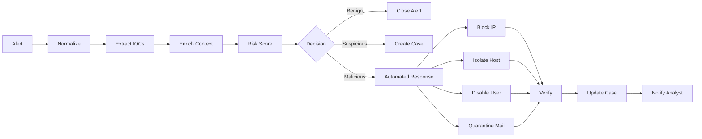

# 🛡️ Awesome Security Orchestration, Automation & Response (SOAR)



<p align="center">
  <a href="https://github.com/ishandutta2007/Awesome-Awesome-Awesome"></a>
  <a href="https://discord.gg/jc4xtF58Ve"></a>
  <a href="https://github.com/ishandutta2007/Awesome-Security-Orchestration"></a>
  <a href="https://github.com/ishandutta2007/Awesome-Security-Orchestration/fork"></a>
  <a href="https://github.com/ishandutta2007"></a>
</p>

## ⚡ Top Security Orchestration, Automation & Response (SOAR) Ecosystem

**Curated Directory of Enterprise SaaS Platforms & Open-Source Security Automation Tools**  
*Focused on Security Orchestration, Automated Incident Response, SOC Playbooks, Threat Intelligence Automation, Case Management & Cloud XDR/SIEM Integrations.*  
**Last updated: September 2026**

This repository tracks notable **SaaS/hosted platforms** and **open-source projects** for **Security Orchestration, Automation and Response (SOAR)**. These tools connect SIEM, XDR, EDR, firewalls, email security, threat intelligence, identity systems, ticketing platforms and other security controls so that repetitive investigation and response tasks can be automated through workflows, playbooks and policy-driven actions.

---

## 📌 Table of Contents

- [☁️ SaaS/Hosted Platforms](#️-saashosted-platforms)
- [🔓 Open-Source GitHub Projects](#-open-source-github-projects)
- [⚡ Open-Source SOAR Platforms](#-open-source-soar-platforms)
- [🚨 Open-Source Incident Response \& Case Management](#-open-source-incident-response--case-management)
- [🧠 Open-Source Threat Intelligence \& IOC Automation](#-open-source-threat-intelligence--ioc-automation)
- [🤖 Open-Source Workflow \& Automation Engines](#-open-source-workflow--automation-engines)
- [📡 Open-Source SIEM/XDR \& Security Data Sources](#-open-source-siemxdr--security-data-sources)
- [🎯 Suggested Open-Source Architecture by Use Case](#-suggested-open-source-architecture-by-use-case)
- [🔄 Commercial SOAR → Open-Source Equivalents](#-commercial-soar--open-source-equivalents)
- [🧱 Frameworks for Building Custom SOAR Systems](#-frameworks-for-building-custom-soar-systems)
- [📐 Reference Open-Source SOAR Architecture](#-reference-open-source-soar-architecture)
- [⚙️ Typical SOAR Workflow](#️-typical-soar-workflow)
- [🤖 AI-Assisted Open-Source SOAR](#-ai-assisted-open-source-soar)
- [📈 Star History](#-star-history)
- [🤝 How to Contribute](#-how-to-contribute)
- [⚠️ Disclaimer](#️-disclaimer)

---

## ☁️ SaaS/Hosted Platforms

> 🌐 **Market Overview**: The global Security Orchestration, Automation and Response (SOAR) market is estimated at **$1.8 Billion to $2.2 Billion (2026)** and is projected to reach **$3.5+ Billion by 2030** (growing at a ~15.2% CAGR). The market is **moderately fragmented**, featuring dominant cloud hyper-scalers and enterprise cybersecurity giants (Microsoft, Google, Cisco/Splunk, IBM, Palo Alto Networks, Fortinet) alongside innovative specialist hyperautomation vendors (Tines, Torq, Swimlane).

*Note: The table below is sorted by **Company Size (Revenue / Market Cap / Valuation)** in descending order.* ⬇️

| Platform | Description | Starting Pricing | Free Tier / Trial Limit | Company Size (Rev / Valuation) |
| --- | --- | --- | --- | --- |
| **[Microsoft Sentinel](https://azure.microsoft.com/products/microsoft-sentinel/)** ☁️ | Cloud-native SIEM/SOAR platform using automation rules and Logic Apps playbooks to orchestrate security response across Microsoft and third-party services. | $4.30 / GB ingested (Pay-As-You-Go analytics tier; commitment tiers start at 100 GB/day for $100/day) | 31-day free trial (includes up to 10 GB/day of free data ingestion per workspace, up to 20 workspaces) | **~$245B Revenue** / ~$3.1T Market Cap (Parent: Microsoft) |
| **[Google SecOps](https://cloud.google.com/security/products/security-operations)** 🌐 | Cloud security operations platform combining SIEM, threat intelligence, detection and SOAR capabilities (formerly Chronicle & Siemplify). | $2,500 / month ($30,000/year base commit tier; or ~$45/employee/year in legacy model) | 30-day POC free trial (sales-assisted proof-of-concept trial via Google Cloud sales/partners) | **~$307B Revenue** / ~$2.0T Market Cap (Parent: Alphabet) |
| **[Splunk SOAR](https://www.splunk.com/en_us/products/splunk-security-orchestration-and-automation.html)** ⚡ | Security automation platform integrating investigation, enrichment and response workflows with Splunk's security ecosystem (formerly Phantom). | $2,000 / seat / year (commercial analyst seats; 5-seat minimum deployment) | Free Community Edition (free forever, limited to 100 actions/day, 1 tenant, and 5 open cases max) | **~$54B Revenue** / ~$200B Market Cap (Parent: Cisco; $28B M&A) |
| **[IBM QRadar SOAR](https://www.ibm.com/products/qradar-soar)** 🧠 | Enterprise incident-response and orchestration platform with case management, playbooks, threat intelligence and response automation (formerly Resilient). | $4,166 / month ($50,000/year starting tier per base user seat pack) | 30-day POC free trial (sales-assisted evaluation trial; standalone SIEM Community Edition provides 100 EPS) | **~$62B Revenue** / ~$180B Market Cap (Parent: IBM) |
| **[Palo Alto Networks Cortex XSOAR](https://www.paloaltonetworks.com/cortex/cortex-xsoar)** 🛡️ | Enterprise SOAR platform for incident management, playbooks, threat intelligence, investigation and automated response (formerly Demisto). | $25,000 / year (AWS Marketplace base enterprise license; ~$2,083/mo) | 30-day free trial (full features; Community Edition offered 1 user / request-limited single node access) | **~$8.0B Revenue** / ~$110B Market Cap (Palo Alto Networks) |
| **[FortiSOAR](https://www.fortinet.com/products/fortisoar)** 🔐 | Security orchestration platform integrated with Fortinet and third-party security technologies for automated incident response and SOC workflows. | $292 / month ($3,500/year for Starter Edition, up to 10,000 playbook actions/day) | Free Trial License (unlimited duration, restricted to 2–3 users and 200 playbook actions/day) | **~$5.3B Revenue** / ~$60B Market Cap (Parent: Fortinet) |
| **[OpenText ArcSight SOAR](https://www.opentext.com/products/arcsight-soar)** 🏛️ | Security orchestration and automated response capabilities integrated with the ArcSight security ecosystem. | $3,500 / month ($42,000/year starting tier when added to ArcSight ESM/Recon environment) | 30-day POC free trial (sales-assisted evaluation trial; free add-on for existing ArcSight ESM licensees) | **~$5.8B Revenue** / ~$8.5B Market Cap (Parent: OpenText) |
| **[Rapid7 InsightConnect](https://www.rapid7.com/products/insightconnect/)** 🔗 | Security orchestration and automation platform connecting security tools and operational systems through low-code workflows. | $2.15 / asset / month ($25.80/asset/year when bundled with InsightIDR SIEM) | 30-day free trial (full features on the Rapid7 Insight Platform) | **~$780M Revenue** / ~$2.5B Market Cap (Rapid7) |
| **[Sumo Logic Cloud SOAR](https://www.sumologic.com/solutions/cloud-soar)** 📊 | Cloud-based SOAR capabilities for alert triage, enrichment, investigation and response automation (formerly DFLABS IncMan). | $250 / month ($3,000/year Flex Credits starter plan; Cloud SOAR Enterprise tier starting at $2,500/month) | 30-day free trial (includes 1 GB/day data ingestion and 30 days data retention limit) | **~$300M Revenue** / ~$1.7B Valuation (Acquired by Francisco Partners) |
| **[Securonix](https://www.securonix.com/)** 📈 | Security analytics and operations platform incorporating automation, orchestration and response capabilities. | $3.00 / GB ingested / day ($2,500/month minimum ingestion capacity tier) | 30-day POC free trial (sales-assisted POC trial; offers Free SIEM Upgrade migration program) | **~$100M+ Revenue** / ~$1.0B+ Valuation (Backed by Vista Equity) |
| **[Tines](https://www.tines.com/)** 🤖 | No-code/low-code security automation platform built around visual workflows, stories, API integrations and event-driven automation. | $500 / month ($6,000/year billed annually for Starter tier) | Free Community Edition (free forever for 1 builder seat, 3 active workflows/stories, 25,000 events/month) | **~$30M–$50M Revenue** / ~$600M Valuation (Backed by Accel, Felicis) |
| **[NetWitness](https://www.netwitness.com/)** 📡 | Security operations platform incorporating detection, investigation and response automation. | $3,000 / month ($36,000/year starting tier for NetWitness Orchestration/SOAR module) | 30-day POC free trial (sales-assisted proof-of-concept evaluation trial) | **~$150M Revenue** / ~$500M Valuation (Backed by STG) |
| **[Torq](https://torq.io/)** 🚀 | Security hyperautomation platform focused on event-driven workflows, investigation, remediation and AI-assisted SOC automation. | $3,000 / month ($36,000/year base tier; ~$0.05 per action / workflow execution) | 14-day free trial (full platform sandbox access; TCommunity edition available upon request) | **~$20M–$40M Revenue** / ~$400M Valuation (Backed by Bessemer, Evolution) |
| **[Swimlane](https://swimlane.com/)** 🏊 | Enterprise security automation and SOAR platform providing low-code playbooks, case management, integrations and automated response. | $2,500 / month ($30,000/year Starter Tier base subscription) | 30-day POC free trial (sales-assisted evaluation trial with full Turbine features) | **~$50M Revenue** / ~$350M Valuation (Backed by Activate Capital) |
| **[Hunters](https://hunters.security/)** 🎯 | Cloud security operations platform focused on automated detection, investigation and response. | $2,000 / month ($24,000/year starting data source integration tier) | 14-day POC free trial (sales-assisted SOC sandbox evaluation trial) | **~$15M–$30M Revenue** / ~$300M Valuation (Backed by Stripes, Snowflake) |
| **[Cyware Orchestrate](https://www.cyware.com/products/cyware-orchestrate)** 🔍 | Security orchestration platform emphasizing threat intelligence automation, incident response and integration across security tools. | $1,500 / month ($18,000/year base tier annual subscription) | 14-day POC free trial (sales-assisted evaluation sandbox trial) | **~$20M–$40M Revenue** / ~$250M Valuation (Backed by Ten Eleven, Advent) |
| **[D3 Security](https://d3security.com/)** 🛡️ | Enterprise SOAR platform focused on investigation, response automation, case management and MITRE ATT&CK-aligned workflows. | $1,667 / month ($20,000/year Smart SOAR starting platform tier + user seats) | 30-day POC free trial (sales-assisted proof-of-concept sandbox trial) | **~$15M–$30M Revenue** / ~$150M Valuation (Privately Held / Bootstrapped) |

---

## 🔓 Open-Source GitHub Projects

> **Open-Source Advantage**: Self-hostable, transparent, modular security automation engines, threat-intelligence knowledge graphs, case-management suites, and alert-enrichment tools.

*Note: Repositories below are sorted by **GitHub Star Count (Descending)**.* ⬇️

1. **[n8n](https://github.com/n8n-io/n8n)** [](https://github.com/n8n-io/n8n/stargazers) ⚡  
   Fair-code workflow automation tool with extensive node integrations, webhooks, and visual workflow canvas used for building custom security orchestrations.

2. **[Grafana](https://github.com/grafana/grafana)** [](https://github.com/grafana/grafana/stargazers) 📊  
   Open and composable analytics and observability platform used by SOCs for security metrics, incident dashboards, and alert visualization.

3. **[Ansible](https://github.com/ansible/ansible)** [](https://github.com/ansible/ansible/stargazers) 🛠️  
   Radically simple IT automation engine used for automated incident containment, endpoint isolation, user account management, and network firewall configuration.

4. **[Prometheus](https://github.com/prometheus/prometheus)** [](https://github.com/prometheus/prometheus/stargazers) 📈  
   Systems monitoring and alerting toolkit designed for scraping metric targets, evaluating alert rules, and dispatching security triggers.

5. **[Apache Airflow](https://github.com/apache/airflow)** [](https://github.com/apache/airflow/stargazers) ⚙️  
   Platform created by community to programmatically author, schedule, and monitor workflows for batch threat-intelligence ingestion and security data processing.

6. **[Apache Kafka](https://github.com/apache/kafka)** [](https://github.com/apache/kafka/stargazers) 🌊  
   Distributed event-streaming platform capable of handling high-throughput security event logs and feeding SOAR event-triage pipelines.

7. **[Nuclei](https://github.com/projectdiscovery/nuclei)** [](https://github.com/projectdiscovery/nuclei/stargazers) 🔍  
   Fast and customizable vulnerability scanner based on simple YAML DSL templates for automated web & network asset verification.

8. **[Kestra](https://github.com/kestra-io/kestra)** [](https://github.com/kestra-io/kestra/stargazers) 🤖  
   Infinitely scalable, event-driven orchestration platform that builds security data workflows in YAML code.

9. **[Node-RED](https://github.com/node-red/node-red)** [](https://github.com/node-red/node-red/stargazers) 🔴  
   Low-code programming for event-driven security integration, webhooks, REST API calls, and alert notification flows.

10. **[osquery](https://github.com/osquery/osquery)** [](https://github.com/osquery/osquery/stargazers) 🖥️  
    SQL-powered operating system instrumentation, monitoring, and analytics framework for queryable security telemetry.

11. **[Temporal](https://github.com/temporalio/temporal)** [](https://github.com/temporalio/temporal/stargazers) ⏳  
    Durable execution platform enabling developer teams to build fault-tolerant, long-running incident response workflows without losing state.

12. **[SpiderFoot](https://github.com/smicallef/spiderfoot)** [](https://github.com/smicallef/spiderfoot/stargazers) 🕷️  
    Automated OSINT collection and recon platform useful for enriching domains, IP addresses, hashes, and organization targets.

13. **[NATS](https://github.com/nats-io/nats-server)** [](https://github.com/nats-io/nats-server/stargazers) 🚀  
    High-performance cloud-native messaging system designed for microservice communication in security automation platforms.

14. **[Windmill](https://github.com/windmill-labs/windmill)** [](https://github.com/windmill-labs/windmill/stargazers) 💨  
    Developer-focused open-source automation platform converting Python, TypeScript, Go, and Bash scripts into workflows and internal UIs.

15. **[Argo Workflows](https://github.com/argoproj/argo-workflows)** [](https://github.com/argoproj/argo-workflows/stargazers) 🐙  
    Container-native workflow engine for orchestrating parallel security jobs and Kubernetes automated response tasks.

16. **[Wazuh](https://github.com/wazuh/wazuh)** [](https://github.com/wazuh/wazuh/stargazers) 🛡️  
    Free and open-source SIEM / XDR platform providing endpoint protection, log analysis, vulnerability detection, and active response execution.

17. **[OWASP ZAP](https://github.com/zaproxy/zaproxy)** [](https://github.com/zaproxy/zaproxy/stargazers) ⚡  
    World-class open-source web application security scanner for automated penetration testing and dynamic security validation.

18. **[Salt Project](https://github.com/saltstack/salt)** [](https://github.com/saltstack/salt/stargazers) 🧂  
    Event-driven infrastructure automation and remote execution engine capable of instant host-level security remediation.

19. **[OpenSearch](https://github.com/opensearch-project/OpenSearch)** [](https://github.com/opensearch-project/OpenSearch/stargazers) 🔎  
    Community-driven, open-source search and analytics suite used as the scalable log storage and security analytics backend.

20. **[Atomic Red Team](https://github.com/redcanaryco/atomic-red-team)** [](https://github.com/redcanaryco/atomic-red-team/stargazers) ⚛️  
    Small, highly targeted security tests mapped to the MITRE ATT&CK framework to validate security detections and SOAR triggers.

21. **[OpenCTI](https://github.com/OpenCTI-Platform/opencti)** [](https://github.com/OpenCTI-Platform/opencti/stargazers) 🧠  
    Open Cyber Threat Intelligence platform using STIX2 standards and knowledge graphs to manage indicators, threat actors, and campaigns.

22. **[Falco](https://github.com/falcosecurity/falco)** [](https://github.com/falcosecurity/falco/stargazers) 🦅  
    Cloud-native runtime security threat detection engine for Linux, Kubernetes, and container environments.

23. **[Zeek](https://github.com/zeek/zeek)** [](https://github.com/zeek/zeek/stargazers) 📡  
    Powerful network security monitoring framework producing structured behavioral logs and event streams for automated triage.

24. **[MITRE Caldera](https://github.com/mitre/caldera)** [](https://github.com/mitre/caldera/stargazers) 🌋  
    Automated adversary emulation system built on the MITRE ATT&CK framework to test response playbooks.

25. **[Infection Monkey](https://github.com/guardicore/monkey)** [](https://github.com/guardicore/monkey/stargazers) 🐒  
    Open-source breach and attack simulation (BAS) tool that assesses network resilience against automated lateral movement.

26. **[Suricata](https://github.com/OISF/suricata)** [](https://github.com/OISF/suricata/stargazers) 🐯  
    High-performance network IDS/IPS and threat detection engine generating JSON alert feeds for automation.

27. **[StackStorm](https://github.com/StackStorm/st2)** [](https://github.com/StackStorm/st2/stargazers) ⚡  
    Apache-2.0 licensed event-driven automation platform with rules, sensors, workflows, ChatOps, and 160+ integration packs.

28. **[MISP](https://github.com/MISP/MISP)** [](https://github.com/MISP/MISP/stargazers) 🌐  
    Open-source threat-intelligence sharing platform supporting IOC correlations, taxonomies, automated feeds, and ZMQ/Kafka pub-sub.

29. **[Rundeck](https://github.com/rundeck/rundeck)** [](https://github.com/rundeck/rundeck/stargazers) 🏃  
    Open-source operational runbook automation for self-service incident remediation, account disabling, and log collection.

30. **[GRR Rapid Response](https://github.com/google/grr)** [](https://github.com/google/grr/stargazers) 🚨  
    Incident-response framework focused on remote live forensics and memory investigation on enterprise endpoints.

31. **[Cilium Tetragon](https://github.com/cilium/tetragon)** [](https://github.com/cilium/tetragon/stargazers) 🛡️  
    eBPF-based real-time security observability and runtime enforcement engine for Linux kernel security events.

32. **[IntelOwl](https://github.com/intelowlproject/IntelOwl)** [](https://github.com/intelowlproject/IntelOwl/stargazers) 🦉  
    Threat intelligence / OSINT automation platform to analyze files, IPs, domains, and IOC observables across 80+ analyzers.

33. **[Velociraptor](https://github.com/Velocidex/velociraptor)** [](https://github.com/Velocidex/velociraptor/stargazers) 🦖  
    Advanced digital forensics and incident response (DFIR) endpoint monitoring, collection, and hunting platform.

34. **[TheHive](https://github.com/TheHive-Project/TheHive)** [](https://github.com/TheHive-Project/TheHive/stargazers) 🐝  
    Collaborative security incident response and case management platform designed for SOC analysts, CSIRTs, and incident managers.

35. **[Shuffle](https://github.com/Shuffle/Shuffle)** [](https://github.com/Shuffle/Shuffle/stargazers) 🔀  
    Open-source dedicated security automation/SOAR platform featuring a visual workflow editor, OpenAPI app generator, and distributed workers.

36. **[OpenBAS](https://github.com/OpenBAS-Platform/openbas)** [](https://github.com/OpenBAS-Platform/openbas/stargazers) 🎯  
    Open Breach & Attack Simulation platform for planning and executing crisis exercises and automated security playbook validation.

37. **[Cortex](https://github.com/TheHive-Project/Cortex)** [](https://github.com/TheHive-Project/Cortex/stargazers) 🔬  
    Observable analysis and active-response engine providing automated VirusTotal, WHOIS, DNS, sandbox, and threat enrichment via REST API.

38. **[DFIR-IRIS](https://github.com/dfir-iris/iris-web)** [](https://github.com/dfir-iris/iris-web/stargazers) 🌺  
    Collaborative web-based incident-response platform for organizing investigations, technical evidence, IOC timelines, and automated enrichment.

---

## ⚡ Open-Source SOAR Platforms

### 🔀 Shuffle
**[Shuffle](https://github.com/Shuffle/Shuffle)** is the closest match to a conventional open-source SOAR platform.
- Visual drag-and-drop workflow editor
- OpenAPI-based application importer
- Webhooks and event triggers
- Sub-workflows and execution conditions
- Distributed hybrid workers (on-premise + cloud)
- MSSP multi-organization support

### ⚡ StackStorm
**[StackStorm](https://github.com/StackStorm/st2)** is particularly strong for **event-driven auto-remediation and SOC operations**.
- Rules engine with flexible sensor triggers
- Orquesta and ActionChain workflow engines
- 160+ integration packs with 6,000+ pre-built actions
- ChatOps (Slack, Microsoft Teams, Mattermost)
- Apache-2.0 licensed

---

## 🚨 Open-Source Incident Response & Case Management

### 🐝 TheHive
**[TheHive](https://github.com/TheHive-Project/TheHive)** is designed around collaborative incident response.
- Case tracking, alert triage, tasks, and observables
- Analyst collaboration and case templates
- Deep native integration with Cortex for automated analysis and MISP for threat intelligence sharing

### 🌺 DFIR-IRIS
**[DFIR-IRIS](https://github.com/dfir-iris/iris-web)** is a collaborative incident-response web application.
- Investigation tracking, IOC asset organization, and evidence timelines
- Modular Python extension architecture for automated enrichment
- LGPL-3 licensed

---

## 🧠 Open-Source Threat Intelligence & IOC Automation

### 🌐 MISP
**[MISP](https://github.com/MISP/MISP)** is the leading open-source threat-intelligence sharing platform.
- IOC management, STIX/TAXII standards, taxonomies, and galaxies
- Automated pub/sub synchronization via ZeroMQ & Kafka
- AGPL-3.0 licensed

### 🧠 OpenCTI
**[OpenCTI](https://github.com/OpenCTI-Platform/opencti)** provides a knowledge-graph-oriented threat intelligence platform.
- Mappings for threat actors, campaigns, vulnerabilities, indicators, and MITRE ATT&CK techniques
- Connectors for automated enrichment and SIEM integration
- Apache-2.0 Community Edition

---

## 🎯 Suggested Open-Source Architecture by Use Case

| SOC Use Case | Recommended Open-Source Stack |
| --- | --- |
| **Complete Self-Hosted SOAR Stack** | Shuffle + TheHive + Cortex + MISP + Wazuh |
| **Event-Driven Auto-Remediation** | StackStorm + Wazuh + OpenSearch + Ansible |
| **Threat-Intelligence-Centric SOC** | OpenCTI + MISP + Shuffle + Cortex + IntelOwl |
| **Collaborative DFIR & Forensics** | DFIR-IRIS + Cortex + Velociraptor + osquery |
| **Cloud-Native & K8s Security** | Falco + Tetragon + Wazuh + Argo Workflows + Shuffle |
| **Developer Security Automation** | n8n + Windmill + Kestra + Temporal + Kafka |

---

## 🔄 Commercial SOAR → Open-Source Equivalents

| Commercial Platform | Primary Focus | Strong Open-Source Alternatives |
| --- | --- | --- |
| **Cortex XSOAR** | Enterprise SOAR + playbooks + case management | Shuffle + TheHive + Cortex + MISP |
| **Splunk SOAR** | SIEM-integrated security automation | Shuffle + StackStorm + Wazuh + OpenSearch |
| **Microsoft Sentinel** | Cloud SIEM + Logic Apps SOAR | Wazuh + Shuffle + StackStorm + OpenSearch |
| **Google SecOps** | SIEM + threat intelligence + SOAR | OpenCTI + Wazuh + Shuffle + Cortex |
| **Tines** | Low-code security automation | Shuffle + n8n + Node-RED + StackStorm |
| **Torq** | Security hyperautomation | Shuffle + StackStorm + Temporal + Kestra |
| **Swimlane** | Enterprise low-code SOAR | Shuffle + TheHive + StackStorm |
| **FortiSOAR** | Security orchestration + incident response | Shuffle + StackStorm + TheHive + Cortex |
| **IBM QRadar SOAR** | Case management + response automation | TheHive + Shuffle + Cortex + Wazuh |
| **D3 Security** | Investigation + MITRE ATT&CK SOAR | Shuffle + TheHive + Cortex + MISP |
| **Rapid7 InsightConnect** | Low-code workflow automation | StackStorm + Shuffle + Node-RED |
| **Sumo Logic Cloud SOAR** | Cloud SIEM/SOAR workflows | Shuffle + Wazuh + OpenSearch |
| **Cyware Orchestrate** | Threat intelligence + security orchestration | MISP + OpenCTI + Shuffle + Cortex |

---

## 🧱 Frameworks for Building Custom SOAR Systems

| Layer | Open-Source Technologies |
| --- | --- |
| **SIEM / XDR** | Wazuh · OpenSearch · Security Onion |
| **Network Detection** | Suricata · Zeek |
| **Endpoint Telemetry** | Wazuh · osquery · Velociraptor |
| **SOAR Core** | Shuffle · StackStorm |
| **Case Management** | TheHive · DFIR-IRIS |
| **IOC Analysis** | Cortex · IntelOwl · SpiderFoot |
| **Threat Intelligence** | MISP · OpenCTI |
| **Workflow Engine** | Temporal · Airflow · Argo · Kestra |
| **Automation & Remediation** | Ansible · Node-RED · Rundeck |
| **Messaging Pipeline** | Kafka · NATS |
| **Dashboards & BI** | Grafana · OpenSearch Dashboards |

---

## 📐 Reference Open-Source SOAR Architecture



---

## ⚙️ Typical SOAR Workflow



---

## 🤖 AI-Assisted Open-Source SOAR

Modern Security Operations Centers integrate local and cloud LLMs for automated alert summarization, IOC triage, and incident remediation guidance.

```text
Security Alert Ingestion
         ↓
Shuffle SOAR Workflow
         ↓
Cortex / MISP IOC Enrichment
         ↓
Local LLM Contextual Analysis (Ollama / vLLM)
         ↓
Automated Triage & Risk Summary
         ↓
Analyst Approval Gate
         ↓
Ansible / StackStorm Automated Playbook Execution
```

---

## 📈 Star History

[](https://star-history.dera.page/#ishandutta2007/Awesome-Security-Orchestration&type=date&legend=top-left)

---

## 🤝 How to Contribute

Contributions from the global cybersecurity community are warmly welcomed! Please follow these steps:

1. 🍴 Fork the repository.
2. 📝 Add or update entries in `README.md` following the existing markdown table or badged list format.
3. 🔗 Ensure all links lead to official project sites or valid GitHub stargazers pages.
4. 🚀 Submit a Pull Request (PR) with a brief description of your additions.

Check out [Awesome-Awesome-Awesome](https://github.com/ishandutta2007/Awesome-Awesome-Awesome) curated index for more awesome lists! ⭐

---

## ⚠️ Disclaimer

- This repository is intended strictly as a **technology discovery and architectural reference guide**. All product names, logos, and trademarks belong to their respective owners.
- Commercial platform pricing and valuation figures are based on public financial reports, marketplace listings, and industry data, and are subject to change.
- Automated security playbooks can execute destructive actions (such as host isolation or account disablement). Production SOAR implementations should always incorporate human approval gates, role-based access control (RBAC), audit logging, and credential isolation.

---

<p align="center">
  <b>Made with ❤️ for SOC Analysts, Incident Responders, Threat Hunters, Security Engineers, CISOs & DevSecOps Teams.</b>
</p>
