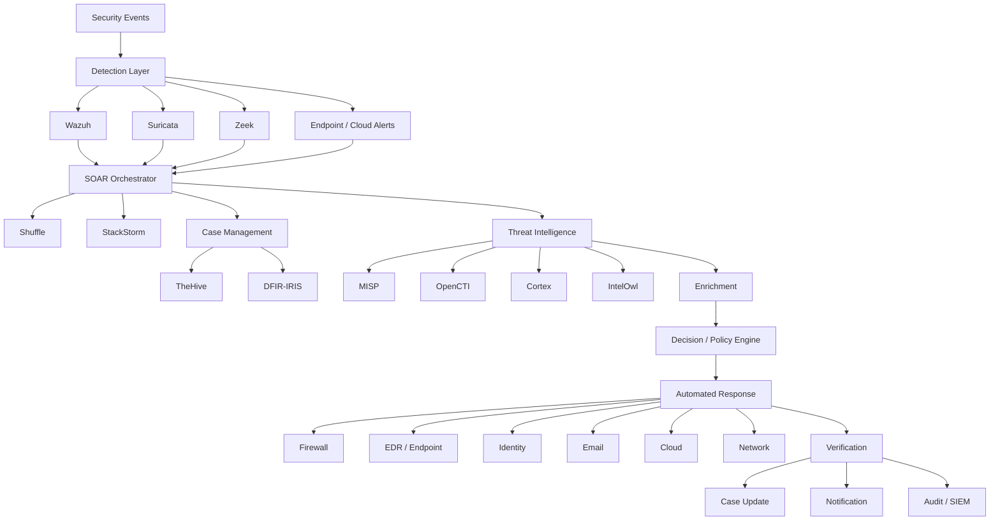
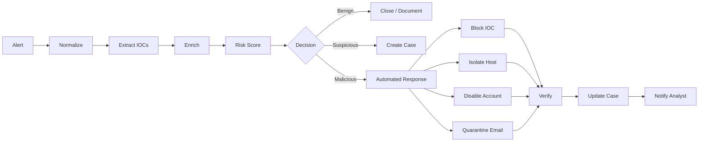

# Awesome-Security-Orchestration

## Top Security Orchestration, Automation & Response (SOAR) Ecosystem

**Curated List of SaaS/Hosted Platforms & Open-Source GitHub Projects**
*Focused on Security Orchestration, Automated Incident Response, SOC Playbooks, Threat Intelligence, Case Management & Security Automation*
**Last updated: September 2026**

This repository tracks notable **SaaS/hosted platforms** and **open-source projects** for **Security Orchestration, Automation and Response (SOAR)**. These tools connect SIEM, XDR, EDR, firewalls, email security, threat intelligence, identity systems, ticketing platforms and other security controls so that repetitive investigation and response tasks can be automated through workflows, playbooks and policy-driven actions.

**Examples** include Palo Alto Networks Cortex XSOAR, Splunk SOAR, Microsoft Sentinel, Google SecOps SOAR, Tines, Torq, Swimlane, FortiSOAR, IBM QRadar SOAR, D3 Security, Rapid7 InsightConnect, Sumo Logic Cloud SOAR and Cyware Orchestrate. Current 2026 comparisons continue to place Cortex XSOAR, Splunk SOAR, Tines, Torq, Swimlane, Microsoft Sentinel and Google SecOps among the major SOAR/automation offerings. ([Deepak Gupta][1])

**Open-source emphasis**: This section is heavily expanded with open-source SOAR platforms and complementary projects for self-hosting, automated alert enrichment, incident response, threat-intelligence automation, case management, IOC analysis, security workflows and SOC orchestration. The strongest open-source approach is generally **compositional** rather than relying on a single product: **Shuffle + TheHive + Cortex + MISP/OpenCTI + Wazuh + DFIR-IRIS + StackStorm** can together provide a substantial open SOC automation stack. Shuffle describes itself as an open-source security automation platform with workflow editing, OpenAPI-based applications and integrations; StackStorm provides event-driven automation, rules, workflows and integration packs. ([GitHub][2])

Contributions welcome! Open a PR to add/update entries. Keep descriptions factual and link to official sites or GitHub repositories.

## Table of Contents

* [SaaS/Hosted Platforms](#saashosted-platforms)
* [Open-Source GitHub Projects](#open-source-github-projects)
* [Open-Source SOAR Platforms](#open-source-soar-platforms)
* [Open-Source Incident Response & Case Management](#open-source-incident-response--case-management)
* [Open-Source Threat Intelligence & IOC Automation](#open-source-threat-intelligence--ioc-automation)
* [Open-Source Workflow & Automation Engines](#open-source-workflow--automation-engines)
* [Open-Source SIEM/XDR & Security Data Sources](#open-source-siemxdr--security-data-sources)
* [Additional Strong Open-Source Options](#additional-strong-open-source-options)
* [Commercial SOAR → Open-Source Equivalents](#commercial-soar--open-source-equivalents)
* [Frameworks for Building Custom SOAR Systems](#frameworks-for-building-custom-soar-systems)
* [Typical SOAR Workflow](#typical-soar-workflow)
* [Reference Open-Source SOAR Architecture](#reference-open-source-soar-architecture)
* [How to Contribute](#how-to-contribute)
* [Disclaimer](#disclaimer)

## SaaS/Hosted Platforms

* **[Palo Alto Networks Cortex XSOAR](https://www.paloaltonetworks.com/cortex/cortex-xsoar)**
  Enterprise SOAR platform for incident management, playbooks, threat intelligence, investigation and automated response, with extensive security-product integrations.

* **[Splunk SOAR](https://www.splunk.com/en_us/products/splunk-security-orchestration-and-automation.html)**
  Security automation platform integrating investigation, enrichment and response workflows with Splunk's security ecosystem.

* **[Microsoft Sentinel](https://azure.microsoft.com/products/microsoft-sentinel/)**
  Cloud-native SIEM/SOAR platform using automation rules and Logic Apps playbooks to orchestrate security response across Microsoft and third-party services.

* **[Google SecOps](https://cloud.google.com/security/products/security-operations)**
  Cloud security operations platform combining SIEM, threat intelligence, detection and SOAR capabilities.

* **[Tines](https://www.tines.com/)**
  No-code/low-code security automation platform built around visual workflows, stories, API integrations and event-driven automation.

* **[Torq](https://torq.io/)**
  Security hyperautomation platform focused on event-driven workflows, investigation, remediation and AI-assisted SOC automation.

* **[Swimlane](https://swimlane.com/)**
  Enterprise security automation and SOAR platform providing low-code playbooks, case management, integrations and automated response.

* **[FortiSOAR](https://www.fortinet.com/products/fortisoar)**
  Security orchestration platform integrated with Fortinet and third-party security technologies for automated incident response and SOC workflows.

* **[IBM QRadar SOAR](https://www.ibm.com/products/qradar-soar)**
  Enterprise incident-response and orchestration platform with case management, playbooks, threat intelligence and response automation.

* **[D3 Security](https://d3security.com/)**
  Enterprise SOAR platform focused on investigation, response automation, case management and MITRE ATT&CK-aligned workflows.

* **[Rapid7 InsightConnect](https://www.rapid7.com/products/insightconnect/)**
  Security orchestration and automation platform connecting security tools and operational systems through low-code workflows.

* **[Sumo Logic Cloud SOAR](https://www.sumologic.com/solutions/cloud-soar)**
  Cloud-based SOAR capabilities for alert triage, enrichment, investigation and response automation.

* **[Cyware Orchestrate](https://www.cyware.com/products/cyware-orchestrate)**
  Security orchestration platform emphasizing threat intelligence automation, incident response and integration across security tools.

* **[Securonix](https://www.securonix.com/)**
  Security analytics and operations platform incorporating automation, orchestration and response capabilities.

* **[OpenText ArcSight SOAR](https://www.opentext.com/products/arcsight-soar)**
  Security orchestration and automated response capabilities integrated with the ArcSight security ecosystem.

* **[NetWitness](https://www.netwitness.com/)**
  Security operations platform incorporating detection, investigation and response automation.

* **[Hunters](https://hunters.security/)**
  Cloud security operations platform focused on automated detection, investigation and response.

### Open-source emphasis

Unlike the commercial platforms above, open-source SOAR usually comes as a collection of interoperable projects:

* **Shuffle** — orchestration and security workflow automation
* **StackStorm** — event-driven automation and remediation
* **TheHive** — incident-response case management
* **Cortex** — observable analysis and active response
* **DFIR-IRIS** — collaborative incident response
* **MISP** — threat-intelligence management and sharing
* **OpenCTI Community Edition** — cyber-threat intelligence knowledge platform
* **Wazuh** — SIEM/XDR and security-event source
* **IntelOwl** — automated OSINT/threat-intelligence enrichment
* **SpiderFoot** — automated OSINT collection
* **n8n** — general workflow automation building block
* **Node-RED** — event-driven integration and automation
* **StackStorm** — event-driven rule/workflow automation
* **Apache Airflow** — scheduled workflow orchestration
* **Argo Workflows** — Kubernetes-native workflow automation
* **Temporal** — durable workflow execution

The distinction is important: **Shuffle and StackStorm are closer to the orchestration/automation core of a SOAR**, whereas projects such as TheHive, Cortex, MISP, OpenCTI and Wazuh provide specialized capabilities that can be orchestrated by the SOAR layer.

## Open-Source GitHub Projects

* **[Shuffle](https://github.com/Shuffle/Shuffle)**
  Open-source security automation platform with visual workflow creation, OpenAPI-based applications, security integrations, distributed workers and automation capabilities. Shuffle is one of the closest open-source projects to a traditional standalone SOAR platform. ([GitHub][2])

* **[StackStorm](https://github.com/StackStorm/st2)**
  Event-driven automation platform for rules, workflows, automated remediation, incident response and integration with external systems. Licensed under Apache-2.0. ([GitHub][3])

* **[TheHive](https://github.com/StrangeBeeCorp/TheHive)**
  Collaborative security incident-response and case-management platform designed for SOCs, CSIRTs and security teams.

* **[Cortex](https://github.com/TheHive-Project/Cortex)**
  Observable analysis and active-response engine capable of automatically analyzing IP addresses, domains, URLs, hashes, files and other observables through analyzers and a REST API. ([GitHub][4])

* **[DFIR-IRIS](https://github.com/dfir-iris/iris-web)**
  Collaborative incident-response platform for organizing investigations, cases, technical evidence and response activities. It provides an API and modular extensions for automated enrichment. ([GitHub][5])

* **[MISP](https://github.com/MISP/MISP)**
  Open-source threat-intelligence sharing platform supporting indicators, events, correlations, automated feeds, APIs, RBAC, publishing/subscribing and integration with security workflows. MISP is licensed under AGPL-3.0. ([GitHub][6])

* **[OpenCTI](https://github.com/OpenCTI-Platform/opencti)**
  Open cyber-threat intelligence platform using structured knowledge, relationships, STIX and connectors to integrate intelligence with security operations. The Community Edition is Apache-2.0 licensed; Enterprise Edition uses a separate license. ([GitHub][7])

* **[Wazuh](https://github.com/wazuh/wazuh)**
  Open-source security platform providing endpoint telemetry, threat detection, vulnerability information, file-integrity monitoring and security analytics that can trigger SOAR workflows.

* **[IntelOwl](https://github.com/intelowlproject/IntelOwl)**
  Open-source threat-intelligence/OSINT automation platform for analyzing files, IPs, domains and other observables through multiple analyzers.

* **[SpiderFoot](https://github.com/smicallef/spiderfoot)**
  Automated OSINT platform useful for enriching domains, IP addresses, organizations and other indicators during security investigations.

* **[TheHive Project Cortex Analyzers](https://github.com/TheHive-Project/Cortex-Analyzers)**
  Collection of analyzer integrations that can be invoked by Cortex/TheHive workflows to enrich security observables.

* **[MISP Modules](https://github.com/MISP/misp-modules)**
  Extensible collection of modules for enriching and processing MISP events and indicators.

* **[MISP Playbooks](https://github.com/MISP/misp-playbooks)**
  Playbook collection for automating MISP-related security workflows. The repository is BSD-2-Clause licensed. ([GitHub][8])

### Additional Strong Open-Source Options

* **[Shuffle](https://github.com/Shuffle/Shuffle)** — dedicated open-source security automation/SOAR.
* **[StackStorm](https://github.com/StackStorm/st2)** — event-driven orchestration and automated remediation.
* **[TheHive](https://github.com/StrangeBeeCorp/TheHive)** — incident-response and case management.
* **[Cortex](https://github.com/TheHive-Project/Cortex)** — automated observable analysis.
* **[DFIR-IRIS](https://github.com/dfir-iris/iris-web)** — collaborative incident response.
* **[MISP](https://github.com/MISP/MISP)** — threat-intelligence sharing and automation.
* **[OpenCTI](https://github.com/OpenCTI-Platform/opencti)** — cyber-threat intelligence knowledge graph.
* **[Wazuh](https://github.com/wazuh/wazuh)** — SIEM/XDR and endpoint telemetry.
* **[IntelOwl](https://github.com/intelowlproject/IntelOwl)** — automated threat intelligence.
* **[SpiderFoot](https://github.com/smicallef/spiderfoot)** — OSINT enrichment.
* **[Cortex Analyzers](https://github.com/TheHive-Project/Cortex-Analyzers)** — automated IOC analysis.
* **[MISP Modules](https://github.com/MISP/misp-modules)** — enrichment and transformation modules.
* **[MISP Playbooks](https://github.com/MISP/misp-playbooks)** — reusable threat-intelligence automation.
* **[Node-RED](https://github.com/node-red/node-red)** — event-driven workflow automation.
* **[Apache Airflow](https://github.com/apache/airflow)** — scheduled workflow orchestration.
* **[Argo Workflows](https://github.com/argoproj/argo-workflows)** — Kubernetes-native workflow engine.
* **[Temporal](https://github.com/temporalio/temporal)** — durable distributed workflows.
* **[Windmill](https://github.com/windmill-labs/windmill)** — developer-oriented workflow automation.
* **[Kestra](https://github.com/kestra-io/kestra)** — event-driven workflow orchestration.
* **[Rundeck](https://github.com/rundeck/rundeck)** — operational runbook automation.
* **[Ansible](https://github.com/ansible/ansible)** — infrastructure and response automation.
* **[Salt Project](https://github.com/saltstack/salt)** — event-driven configuration and remediation automation.
* **[NATS](https://github.com/nats-io/nats-server)** — lightweight event/messaging infrastructure.
* **[Apache Kafka](https://github.com/apache/kafka)** — event streaming for security automation.
* **[OpenSearch](https://github.com/opensearch-project/OpenSearch)** — security analytics and searchable event data.
* **[Wazuh](https://github.com/wazuh/wazuh)** — detection source and automated-response trigger.
* **[Suricata](https://github.com/OISF/suricata)** — IDS/IPS events for automated response.
* **[Zeek](https://github.com/zeek/zeek)** — network telemetry and behavioral detection.
* **[Falco](https://github.com/falcosecurity/falco)** — runtime security events.
* **[Cilium Tetragon](https://github.com/cilium/tetragon)** — eBPF-based security enforcement and observability.

## Open-Source SOAR Platforms

### Shuffle

**[Shuffle](https://github.com/Shuffle/Shuffle)** is the closest match to a conventional open-source SOAR platform.

It provides:

* Visual workflow editor
* Security-oriented applications
* OpenAPI integrations
* Webhooks
* Workflow execution
* Sub-workflows
* Distributed workers
* Python applications
* Security-tool integrations
* MSSP-oriented organization support
* On-premise deployment
* Docker-based deployment
* API-driven automation

Shuffle's repository currently describes it as a general-purpose security automation platform and provides workflow, application and worker components. ([GitHub][2])

### StackStorm

**[StackStorm](https://github.com/StackStorm/st2)** is particularly strong when the priority is **event-driven automation and response** rather than a SOC case-management UI.

It provides:

* Rules engine
* Event triggers
* Workflows
* Actions
* Sensors
* Integration packs
* ChatOps
* Automated remediation
* Incident response
* Python automation
* REST APIs

StackStorm is Apache-2.0 licensed. ([GitHub][3])

## Open-Source Incident Response & Case Management

### TheHive

**[TheHive](https://github.com/StrangeBeeCorp/TheHive)** is designed around collaborative incident response.

Typical capabilities include:

* Cases
* Alerts
* Tasks
* Observables
* Investigations
* Analyst collaboration
* Case templates
* API integration
* Cortex integration
* MISP integration

It is particularly useful as the **human analyst/case-management layer** of an open-source SOAR architecture.

### DFIR-IRIS

**[DFIR-IRIS](https://github.com/dfir-iris/iris-web)** is a collaborative incident-response platform with modular extensions and an API.

It can be used for:

* Incident tracking
* Investigation management
* Evidence organization
* IOC enrichment
* Analyst collaboration
* Automated modules
* Integration with MISP and other security tools

DFIR-IRIS is LGPL-3 licensed. ([GitHub][5])

## Open-Source Threat Intelligence & IOC Automation

### MISP

**[MISP](https://github.com/MISP/MISP)** is one of the most important open-source components for SOAR-based threat-intelligence automation.

It provides:

* IOC management
* Threat-intelligence sharing
* STIX support
* Correlation
* Taxonomies
* Galaxies
* Feeds
* APIs
* ZMQ/Kafka publishing
* RBAC
* Automated synchronization
* Enrichment

MISP explicitly supports automated publication/subscription and integration with other security tools, making it an excellent SOAR data source. ([GitHub][6])

### OpenCTI

**[OpenCTI](https://github.com/OpenCTI-Platform/opencti)** provides a knowledge-oriented threat-intelligence platform.

It is useful for:

* Threat actors
* Malware
* Campaigns
* Vulnerabilities
* Indicators
* Attack techniques
* Relationships
* STIX
* Connectors
* Automated intelligence enrichment

The OpenCTI Community Edition is Apache-2.0 licensed, while its Enterprise Edition has a separate license. ([GitHub][7])

### Cortex

**[Cortex](https://github.com/TheHive-Project/Cortex)** is particularly useful as an **automated enrichment engine**.

For example:

```text
Alert
  ↓
Extract IOC
  ↓
Cortex Analyzer
  ↓
VirusTotal / WHOIS / DNS / Sandbox / Reputation
  ↓
Enrichment
  ↓
SOAR Decision
```

Cortex supports bulk observable analysis and automation through its REST API. ([GitHub][4])

## Open-Source Workflow & Automation Engines

### Node-RED

**[Node-RED](https://github.com/node-red/node-red)**

Useful for:

* Webhooks
* API calls
* Event processing
* Security integrations
* MQTT
* REST
* Data transformation
* Notifications
* Custom response workflows

### Apache Airflow

**[Apache Airflow](https://github.com/apache/airflow)**

Useful when security workflows involve:

* Scheduled enrichment
* Threat-feed ingestion
* Data processing
* Batch workflows
* Reporting
* Periodic threat-hunting jobs

### Argo Workflows

**[Argo Workflows](https://github.com/argoproj/argo-workflows)**

Kubernetes-native workflow engine suitable for cloud-native security automation.

### Temporal

**[Temporal](https://github.com/temporalio/temporal)**

Durable workflow platform useful for long-running response processes where workflows must survive infrastructure failures and resume reliably.

### Kestra

**[Kestra](https://github.com/kestra-io/kestra)**

Event-driven orchestration platform suitable for API integrations, scheduled security operations and data workflows.

### Windmill

**[Windmill](https://github.com/windmill-labs/windmill)**

Developer-focused automation platform supporting scripts, workflows, APIs and scheduled jobs.

### Rundeck

**[Rundeck](https://github.com/rundeck/rundeck)**

Useful for creating controlled operational runbooks such as:

* Disable account
* Isolate host
* Restart service
* Block IP
* Collect logs
* Run forensic commands
* Execute remediation

## Open-Source SIEM/XDR & Security Data Sources

SOAR normally sits **above detection systems**, so the following projects are important sources of alerts and response triggers.

### Wazuh

**[Wazuh](https://github.com/wazuh/wazuh)**

Useful for:

* Endpoint alerts
* File-integrity events
* Vulnerability alerts
* Malware detections
* Authentication events
* Security configuration events

These events can trigger Shuffle, StackStorm or custom automation.

### Suricata

**[Suricata](https://github.com/OISF/suricata)**

Useful for:

* IDS alerts
* IPS events
* Network signatures
* Malware traffic
* Command-and-control detection

### Zeek

**[Zeek](https://github.com/zeek/zeek)**

Provides network telemetry that can feed:

* Threat detection
* IOC correlation
* Threat hunting
* Automated investigation

### Falco

**[Falco](https://github.com/falcosecurity/falco)**

Useful for runtime security events in:

* Kubernetes
* Containers
* Linux systems
* Cloud-native environments

### Tetragon

**[Tetragon](https://github.com/cilium/tetragon)**

Provides eBPF-based security observability and enforcement that can generate automated response events.

## Additional Strong Open-Source Options

### Security Automation

* **[Shuffle](https://github.com/Shuffle/Shuffle)**
* **[StackStorm](https://github.com/StackStorm/st2)**
* **[Node-RED](https://github.com/node-red/node-red)**
* **[Apache Airflow](https://github.com/apache/airflow)**
* **[Argo Workflows](https://github.com/argoproj/argo-workflows)**
* **[Temporal](https://github.com/temporalio/temporal)**
* **[Kestra](https://github.com/kestra-io/kestra)**
* **[Windmill](https://github.com/windmill-labs/windmill)**
* **[Rundeck](https://github.com/rundeck/rundeck)**
* **[Ansible](https://github.com/ansible/ansible)**

### Incident Response

* **[TheHive](https://github.com/StrangeBeeCorp/TheHive)**
* **[DFIR-IRIS](https://github.com/dfir-iris/iris-web)**
* **[Cortex](https://github.com/TheHive-Project/Cortex)**
* **[Velociraptor](https://github.com/Velocidex/velociraptor)**
* **[GRR](https://github.com/google/grr)**
* **[osquery](https://github.com/osquery/osquery)**

### Threat Intelligence

* **[MISP](https://github.com/MISP/MISP)**
* **[OpenCTI](https://github.com/OpenCTI-Platform/opencti)**
* **[IntelOwl](https://github.com/intelowlproject/IntelOwl)**
* **[SpiderFoot](https://github.com/smicallef/spiderfoot)**
* **[Cortex Analyzers](https://github.com/TheHive-Project/Cortex-Analyzers)**
* **[MISP Modules](https://github.com/MISP/misp-modules)**
* **[MISP Playbooks](https://github.com/MISP/misp-playbooks)**

### Detection & Telemetry

* **[Wazuh](https://github.com/wazuh/wazuh)**
* **[Suricata](https://github.com/OISF/suricata)**
* **[Zeek](https://github.com/zeek/zeek)**
* **[Falco](https://github.com/falcosecurity/falco)**
* **[Tetragon](https://github.com/cilium/tetragon)**

### Security Data & Analytics

* **[OpenSearch](https://github.com/opensearch-project/OpenSearch)**
* **[Grafana](https://github.com/grafana/grafana)**
* **[Prometheus](https://github.com/prometheus/prometheus)**
* **[Apache Kafka](https://github.com/apache/kafka)**
* **[NATS](https://github.com/nats-io/nats-server)**
* **[OpenTelemetry](https://github.com/open-telemetry/opentelemetry-collector)**
* **[Vector](https://github.com/vectordotdev/vector)**
* **[Fluent Bit](https://github.com/fluent/fluent-bit)**

### Security Testing & Automated Response

* **[Atomic Red Team](https://github.com/redcanaryco/atomic-red-team)** — ATT&CK-mapped adversary emulation tests.
* **[MITRE Caldera](https://github.com/mitre/caldera)** — automated adversary emulation and security testing.
* **[Infection Monkey](https://github.com/guardicore/monkey)** — breach-and-attack simulation.
* **[OpenBAS](https://github.com/OpenBAS-Platform/openbas)** — breach and attack simulation platform.
* **[Nuclei](https://github.com/projectdiscovery/nuclei)** — template-based vulnerability/security scanning.
* **[OWASP ZAP](https://github.com/zaproxy/zaproxy)** — automated web security testing.

## Commercial SOAR → Open-Source Equivalents

| Commercial Platform       | Primary Focus                                 | Strong Open-Source Alternatives           |
| ------------------------- | --------------------------------------------- | ----------------------------------------- |
| **Cortex XSOAR**          | Enterprise SOAR + playbooks + case management | Shuffle + TheHive + Cortex + MISP         |
| **Splunk SOAR**           | SIEM-integrated security automation           | Shuffle + StackStorm + Wazuh + OpenSearch |
| **Microsoft Sentinel**    | SIEM + cloud SOAR                             | Wazuh + Shuffle + StackStorm + OpenSearch |
| **Google SecOps**         | SIEM + threat intelligence + SOAR             | OpenCTI + Wazuh + Shuffle + Cortex        |
| **Tines**                 | Low-code security automation                  | Shuffle + Node-RED + StackStorm           |
| **Torq**                  | Security hyperautomation                      | Shuffle + StackStorm + Temporal           |
| **Swimlane**              | Enterprise low-code SOAR                      | Shuffle + TheHive + StackStorm            |
| **FortiSOAR**             | Security orchestration + incident response    | Shuffle + StackStorm + TheHive + Cortex   |
| **IBM QRadar SOAR**       | Case management + response automation         | TheHive + Shuffle + Cortex + Wazuh        |
| **D3 Security**           | Investigation + SOAR                          | Shuffle + TheHive + Cortex + MISP         |
| **Rapid7 InsightConnect** | Low-code automation                           | StackStorm + Shuffle + Node-RED           |
| **Sumo Logic Cloud SOAR** | Cloud SIEM/SOAR workflows                     | Shuffle + Wazuh + OpenSearch              |
| **Cyware Orchestrate**    | Threat intelligence + security orchestration  | MISP + OpenCTI + Shuffle + Cortex         |
| **Securonix**             | Security analytics + automation               | Wazuh + OpenSearch + Shuffle + MISP       |
| **ArcSight SOAR**         | SIEM/SOAR integration                         | Wazuh + Shuffle + StackStorm              |
| **NetWitness**            | Network detection + response                  | Zeek + Suricata + Wazuh + Shuffle         |

> **Important:** These are **capability-oriented mappings**, not feature-for-feature replacements. Commercial SOAR platforms combine integrations, case management, playbook engines, support, threat intelligence, security analytics and enterprise governance in a single supported product. Open-source implementations normally require several projects to reproduce the same overall functionality.

## Frameworks for Building Custom SOAR Systems

A strong open-source SOAR architecture can be constructed from the following layers:

| Layer                     | Open-Source Technologies              |
| ------------------------- | ------------------------------------- |
| SIEM/XDR                  | Wazuh · OpenSearch · Security Onion   |
| Network Detection         | Suricata · Zeek                       |
| Endpoint Telemetry        | Wazuh · osquery · Velociraptor        |
| SOAR Core                 | Shuffle · StackStorm                  |
| Case Management           | TheHive · DFIR-IRIS                   |
| IOC Analysis              | Cortex · IntelOwl · SpiderFoot        |
| Threat Intelligence       | MISP · OpenCTI                        |
| Workflow Engine           | Temporal · Airflow · Argo · Kestra    |
| Automation                | Ansible · Node-RED · Rundeck          |
| Policy                    | Open Policy Agent                     |
| Messaging                 | Kafka · NATS                          |
| Data Pipeline             | Fluent Bit · Vector · OpenTelemetry   |
| Search/Analytics          | OpenSearch                            |
| Dashboards                | Grafana · OpenSearch Dashboards       |
| Malware Analysis          | CAPE Sandbox · Cuckoo-derived tooling |
| Vulnerability Scanning    | OpenVAS/Greenbone · Nuclei            |
| Endpoint Response         | Velociraptor · osquery                |
| Cloud/Kubernetes Response | Falco · Tetragon · Kubernetes APIs    |
| Secrets                   | OpenBao · HashiCorp Vault             |
| Notifications             | Matrix · Mattermost · Rocket.Chat     |

## Reference Open-Source SOAR Architecture



## Typical SOAR Workflow



## Recommended Open-Source SOAR Stack

For organizations wanting to build a serious self-hosted SOAR environment, a particularly strong architecture is:

### Detection

**Wazuh + Suricata + Zeek**

### SOAR

**Shuffle + StackStorm**

### Case Management

**TheHive + DFIR-IRIS**

### Threat Intelligence

**MISP + OpenCTI**

### IOC Enrichment

**Cortex + IntelOwl + SpiderFoot**

### Endpoint Investigation

**Velociraptor + osquery**

### Automation

**Ansible + Node-RED**

### Workflow Reliability

**Temporal**

### Security Data

**OpenSearch + Kafka**

### Observability

**Prometheus + Grafana + OpenTelemetry**

This produces a modular architecture covering:

* Alert ingestion
* Alert normalization
* IOC extraction
* Threat-intelligence enrichment
* Automated investigation
* Risk scoring
* Case creation
* Analyst approval
* Automated containment
* Endpoint response
* Firewall response
* Account disabling
* Email remediation
* Threat-intelligence feedback
* Audit logging
* Metrics and reporting

## Example Automated Incident

```text
Wazuh detects suspicious PowerShell activity
        ↓
Shuffle receives alert
        ↓
Extract IP / Domain / Hash
        ↓
Cortex performs IOC enrichment
        ↓
MISP checks known threat intelligence
        ↓
OpenCTI checks related threat actor/campaign
        ↓
Risk score calculated
        ↓
TheHive creates incident
        ↓
Analyst approval required
        ↓
Ansible isolates endpoint
        ↓
Firewall blocks malicious IP
        ↓
Identity platform disables compromised account
        ↓
MISP event updated
        ↓
TheHive case updated
        ↓
SOC notification sent
```

## SOAR Capability Matrix

| Capability                    | Commercial SOAR | Strong Open-Source Options            |
| ----------------------------- | --------------: | ------------------------------------- |
| Playbook Automation           |               ✓ | Shuffle · StackStorm                  |
| Visual Workflow Builder       |               ✓ | Shuffle · Node-RED                    |
| Event-Driven Automation       |               ✓ | StackStorm · Shuffle                  |
| Incident Management           |               ✓ | TheHive · DFIR-IRIS                   |
| IOC Enrichment                |               ✓ | Cortex · IntelOwl · SpiderFoot        |
| Threat Intelligence           |               ✓ | MISP · OpenCTI                        |
| SIEM Integration              |               ✓ | Wazuh · OpenSearch                    |
| Network Detection             |               ✓ | Suricata · Zeek                       |
| Endpoint Response             |               ✓ | Wazuh · Velociraptor                  |
| Case Management               |               ✓ | TheHive · DFIR-IRIS                   |
| Automated Containment         |               ✓ | Ansible · StackStorm · Shuffle        |
| Firewall Automation           |               ✓ | Ansible · APIs · StackStorm           |
| Identity Response             |               ✓ | Keycloak · APIs · Ansible             |
| Email Response                |               ✓ | APIs · Ansible · Shuffle              |
| Malware Analysis              |               ✓ | CAPE/Cuckoo ecosystem                 |
| Vulnerability Enrichment      |               ✓ | Greenbone · Nuclei                    |
| Threat-Intel Sharing          |               ✓ | MISP                                  |
| Threat Knowledge Graph        |               ✓ | OpenCTI                               |
| Security Analytics            |               ✓ | OpenSearch                            |
| Long-Running Workflows        |               ✓ | Temporal                              |
| Kubernetes Automation         |               ✓ | Argo · Falco · Tetragon               |
| Audit Trail                   |               ✓ | TheHive · OpenSearch · Wazuh          |
| AI-Assisted Response          |               ✓ | LLM + local models + workflow engines |
| Global Managed Infrastructure |               ✓ | Requires self-managed infrastructure  |
| Vendor Threat Intelligence    |               ✓ | Must be assembled independently       |
| Commercial Support/SLA        |               ✓ | Community/commercial support varies   |

## Open-Source SOAR vs Commercial SOAR

The main advantage of commercial SOAR platforms is **integration and operational consolidation**.

A mature commercial platform can provide:

* Hundreds of security integrations
* Pre-built playbooks
* Vendor-maintained connectors
* Case management
* Threat intelligence
* RBAC
* Audit trails
* Enterprise support
* High availability
* Upgrade support
* Security governance
* Commercial threat intelligence
* AI-assisted investigation

Open-source SOAR offers different advantages:

* No proprietary lock-in
* Full control over data
* Self-hosting
* Custom integrations
* Custom playbooks
* API-level control
* Transparent source code
* Community-developed integrations
* On-premise deployment
* Cloud-independent architecture
* Ability to combine best-of-breed security tools

The trade-off is that **the organization becomes responsible for integration, maintenance, security hardening, upgrades and reliability**.

## Strongest Open-Source Combinations

### Closest to a Traditional SOAR

**Shuffle + TheHive + Cortex + MISP**

### SOC-Centric SOAR

**Shuffle + Wazuh + TheHive + Cortex + MISP**

### Enterprise Automation

**StackStorm + Wazuh + OpenSearch + Ansible**

### Threat-Intelligence-Centric Automation

**Shuffle + MISP + OpenCTI + Cortex**

### DFIR-Centric Automation

**Shuffle + DFIR-IRIS + Cortex + Velociraptor**

### Network-Security Automation

**Shuffle + Suricata + Zeek + MISP + Cortex**

### Cloud-Native SOAR

**Shuffle + Wazuh + Falco + Tetragon + Kubernetes + Argo**

### Developer/Engineering-Oriented Security Automation

**StackStorm + Temporal + Ansible + Kafka + OpenSearch**

## AI-Assisted Open-Source SOAR

Modern SOAR platforms are increasingly incorporating AI-assisted investigation and automation.

An open-source architecture can incorporate:

* Local LLMs
* Retrieval-augmented generation
* Threat-intelligence retrieval
* Alert summarization
* IOC extraction
* Incident classification
* Playbook recommendation
* Natural-language investigation
* Automated report generation
* Analyst copilots

A possible architecture is:

```text
Security Alert
     ↓
SOAR
     ↓
IOC Extraction
     ↓
MISP / OpenCTI / Cortex
     ↓
Security Context
     ↓
Local LLM
     ↓
Investigation Summary
     ↓
Risk / Confidence
     ↓
Human Approval
     ↓
Automated Playbook
```

For security-sensitive deployments, AI-generated actions should normally be subject to **explicit policy controls, confidence thresholds and human approval**, especially for destructive actions such as account deletion, host isolation or firewall-wide blocking.

## How to Contribute

1. Fork the repo.
2. Add/edit entries in `README.md` following the existing format.
3. Include: project name, official/GitHub link, 1–2 sentence description, and whether it is SaaS or open-source.
4. Prefer actively maintained projects.
5. Clearly distinguish **SOAR platforms** from **supporting security components**.
6. Include license information when known.
7. Avoid listing abandoned projects as current alternatives without clearly marking them.
8. Submit PR with a short explanation.

Star the repo if you find it useful!

## Disclaimer

* This is a **community-curated** list — not exhaustive and not an endorsement.
* Commercial products and trademarks belong to their respective owners.
* Open-source projects listed here are not necessarily complete replacements for commercial SOAR platforms.
* Some projects provide only one component of a complete SOAR architecture.
* Licensing can change; always verify the current license before deployment or redistribution.
* Self-hosted security automation requires appropriate security engineering, access controls, secrets management, monitoring, backups and disaster recovery.
* Automated response can have significant operational consequences. Destructive actions should be tested and governed carefully.
* Production SOAR deployments should use least privilege, approval gates, audit logging and strong credential isolation.
* Security automation must comply with applicable privacy, cybersecurity, employment and data-protection regulations.

---

**Made for SOC analysts, incident responders, threat hunters, security engineers, CISOs, MSSPs, DFIR teams, DevSecOps engineers, and organizations building open and self-hosted Security Orchestration, Automation & Response infrastructure.**
Let's make SOAR more open, interoperable, transparent, automated, and accessible.

[1]: https://guptadeepak.com/tools/top-5-soar-platforms-2026/?utm_source=chatgpt.com "Top 5 SOAR Platforms for 2026: Cortex XSOAR vs Splunk SOAR vs Tines vs Torq vs Swimlane | Deepak Gupta"
[2]: https://github.com/shuffle/shuffle?utm_source=chatgpt.com "GitHub - Shuffle/Shuffle: Shuffle: A general purpose security automation platform. Our focus is on collaboration and resource sharing. · GitHub"
[3]: https://github.com/stackstorm/st2?utm_source=chatgpt.com "GitHub - StackStorm/st2: StackStorm (aka \"IFTTT for Ops\") is event-driven automation for auto-remediation, incident responses, troubleshooting, deployments, and more for DevOps and SREs. Includes rules engine, workflow, 160 integration packs with 6000+ actions (see https://exchange.stackstorm.org) and ChatOps. Installer at https://docs.stackstorm.com/install/index.html · GitHub"
[4]: https://github.com/TheHive-Project/Cortex?utm_source=chatgpt.com "GitHub - TheHive-Project/Cortex: Cortex: a Powerful Observable Analysis and Active Response Engine · GitHub"
[5]: https://github.com/dfir-iris/iris-web?utm_source=chatgpt.com "GitHub - dfir-iris/iris-web: Collaborative Incident Response platform · GitHub"
[6]: https://github.com/misp/misp?utm_source=chatgpt.com "GitHub - MISP/MISP: MISP (core software) - Open Source Threat Intelligence and Sharing Platform · GitHub"
[7]: https://github.com/OpenCTI-Platform/opencti/blob/master/LICENSE?utm_source=chatgpt.com "opencti/LICENSE at master · OpenCTI-Platform/opencti · GitHub"
[8]: https://github.com/MISP/misp-playbooks/blob/main/LICENSE?utm_source=chatgpt.com "misp-playbooks/LICENSE at main · MISP/misp-playbooks · GitHub"

